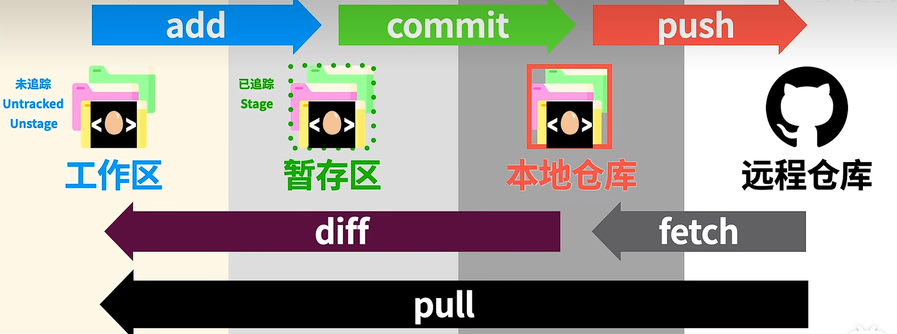
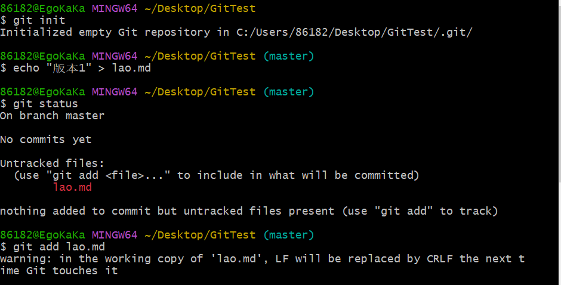
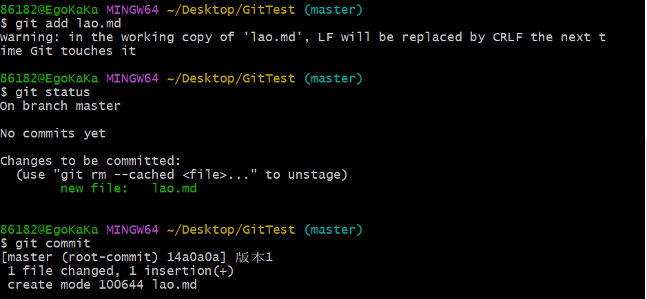
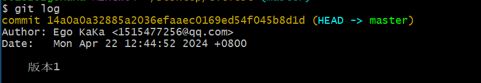
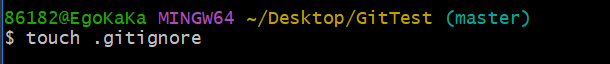

## GitHub使用

### 了解GIt

add ---> commit ---> push

|-----------pull--------------|

### 开始使用

之后可以再次使用git status查看状态，会提示你要提交，提交之后默认会进入vim编辑器模式

git log查看版本，HEAD说明我们在哪个版本这，master代表在这个master主支里

添加忽略文件，在该文件里写入要忽略的文件名称，git就会忽略对应文件，不add

git remote -v查看当前本地仓库与哪个远程仓库有联系（需要个人访问token）

remot    -----    remot add    --------都是与仓库连接有联系的（注意分支名要相同 branch -M（m） ....）