在打包spring项目时，可能遇到该问题

### 一：Java版本不对应

```
There was an error in the forked process
com/heima/JwtTest has been compiled by a more recent version of the Java Runtime (class file version 61.0), this version of the Java Runtime only recognizes class file versions up to 52.0
```

大概率是因为Java版本过低，可以升级JDK，但目前来说删除target目录下的test-classes下的Java类也可以解决，要是再遇到可以查看相对应的Java版本，一一对应

    JDK 17 = 61,
    JDK 16 = 60,
    JDK 15 = 59,
    JDK 14 = 58,
    JDK 13 = 57,
    JDK 12 = 56,
    JDK 11 = 55,
    JDK 10 = 54,
    JDK 9 = 53,
    JDK 8 = 52,
    JDK 7 = 51,
    JDK 6.0 = 50,
    JDK 5.0 = 49,
    JDK 1.4 = 48,
    JDK 1.3 = 47,
    JDK 1.2 = 46,
    JDK 1.1 = 45.0-45.6
    
    Spring Boot 2.x 版本通常建议使用的 JDK（Java Development Kit）版本是 JDK 8、JDK 11 或更高版本，具体取决于 Spring Boot 的子版本。以下是 Spring Boot 2.x 版本与推荐的 JDK 版本的对应关系：
    
    Spring Boot 2.0.x：推荐使用 JDK 8。
    Spring Boot 2.1.x：推荐使用 JDK 8 或 JDK 11。
    Spring Boot 2.2.x：推荐使用 JDK 8 或 JDK 11。
    Spring Boot 2.3.x：推荐使用 JDK 8、JDK 11 或 JDK 14。
    Spring Boot 2.4.x：推荐使用 JDK 8、JDK 11 或 JDK 15。
    Spring Boot 2.5.x：推荐使用 JDK 8、JDK 11 或 JDK 16。
    springboot3.x系列就要JDK17了


### 二：在运行时可能会有maven运行的jdk与idea的配置jdk不一致，或者Springboot与jdk不兼容的问题

例如：无效的。。。（Java17或者release）

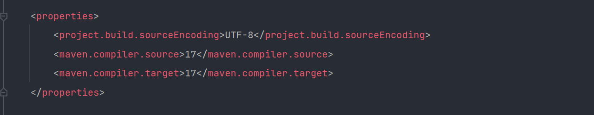

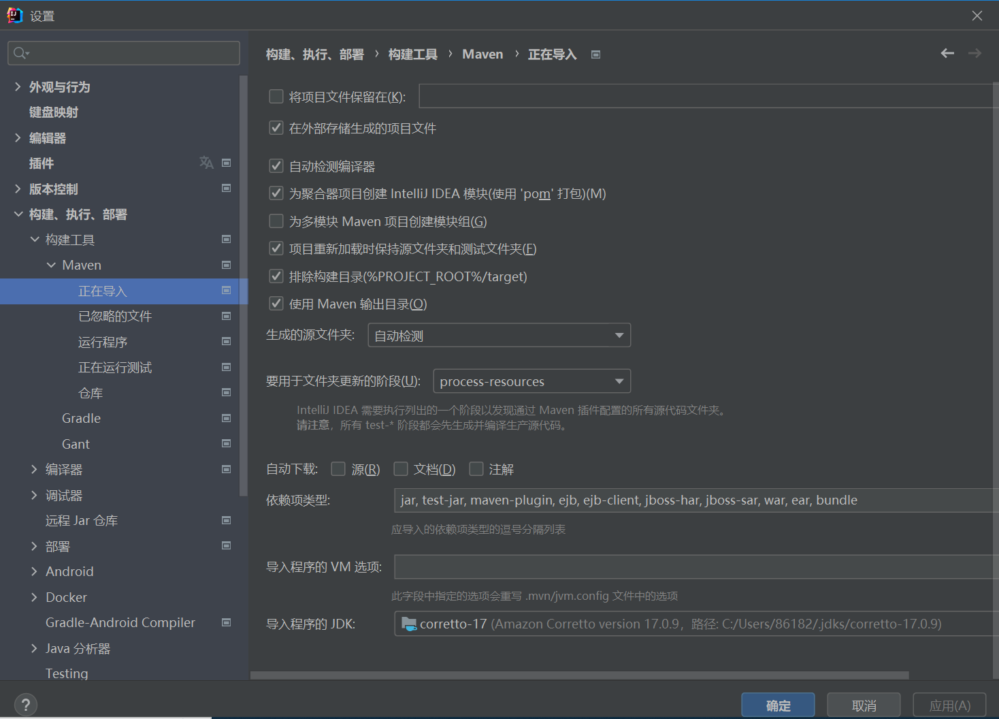

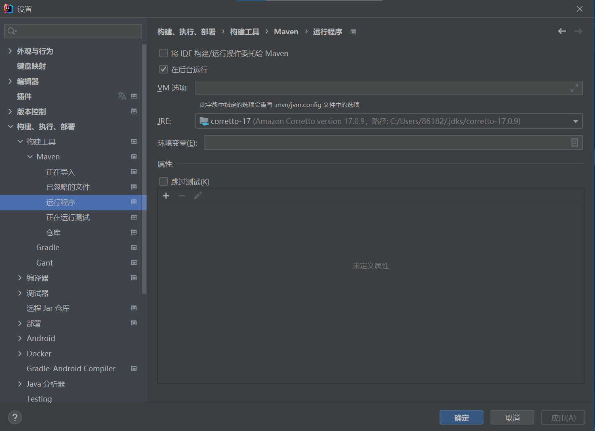

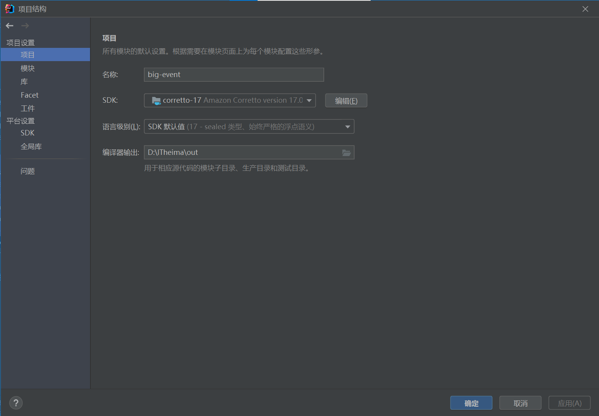

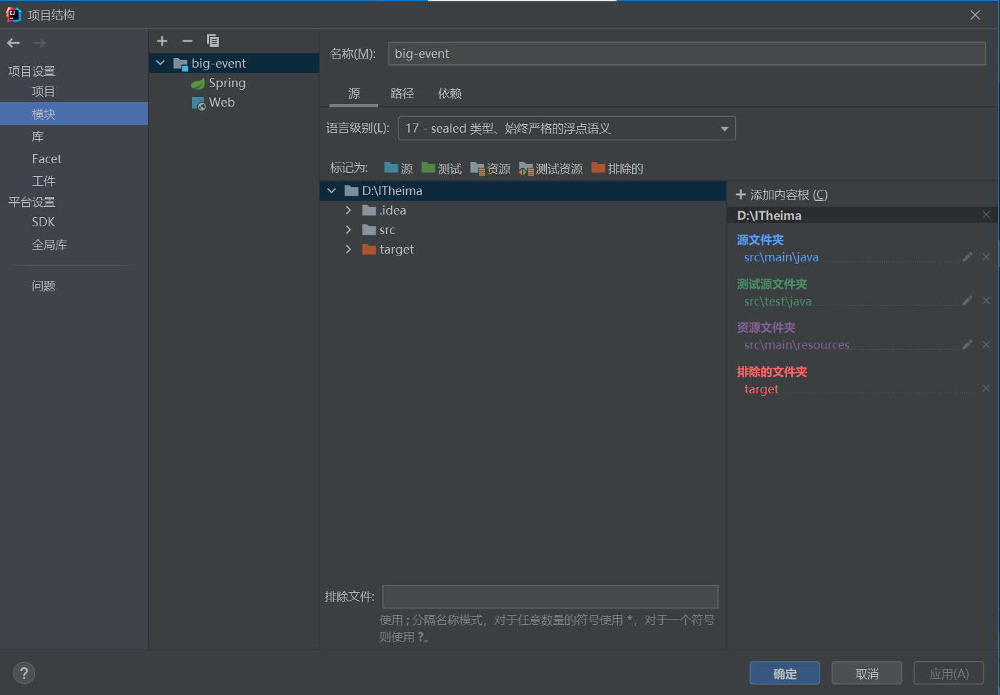

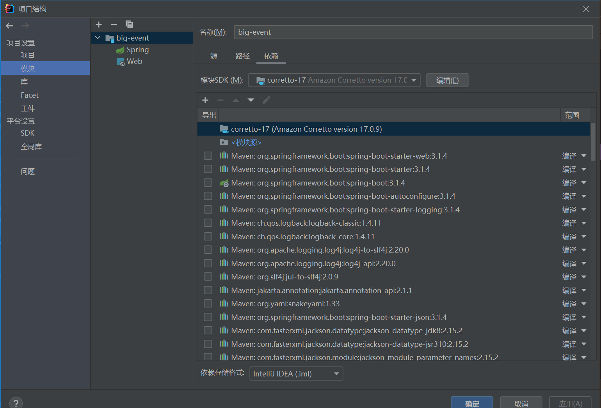

### 三：Maven项目运行jar包时没有主清单等问题

原本默认的pom文件，多了很多插件，可能有一项影响到了打包

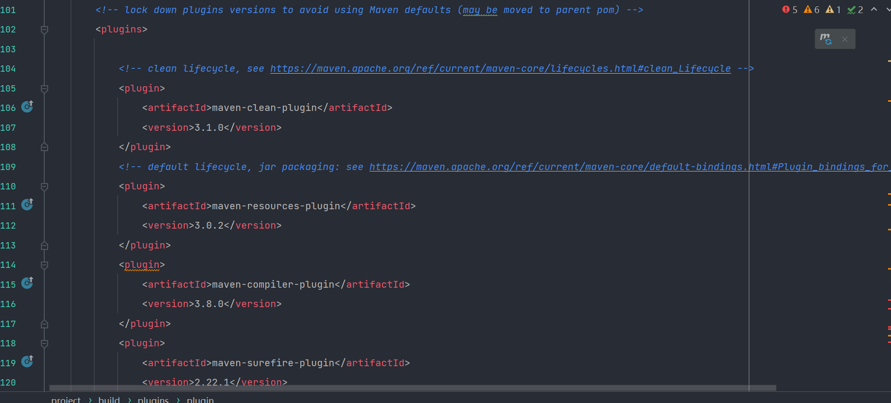

而成功时只有一个插件，确定是在创建Maven项目时默认生成的pom文件中的插件导致的

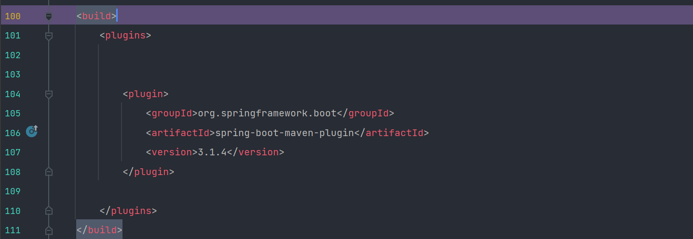

成功时有一个original后缀文件，这就是问题所在，在之前打包时没有该文件

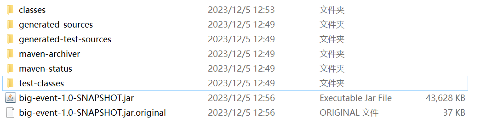

### 四：在运行jar时如果java版本不一致的话，可以更换环境变量中的jdk版本

### 五：创建SpringBoot项目

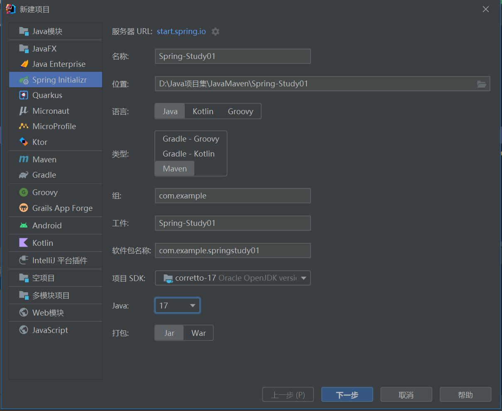

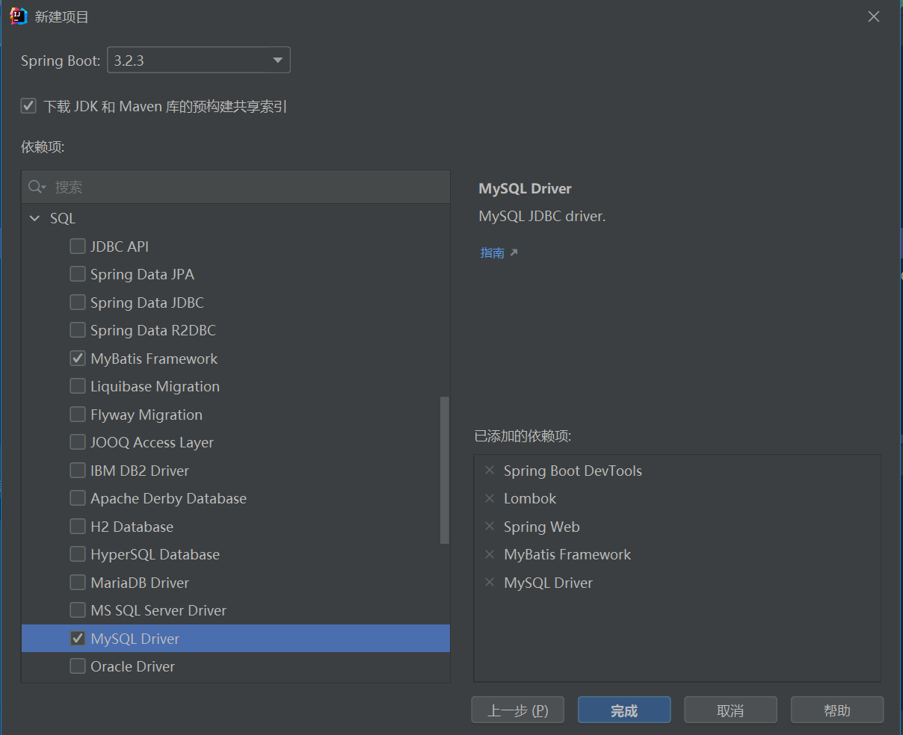